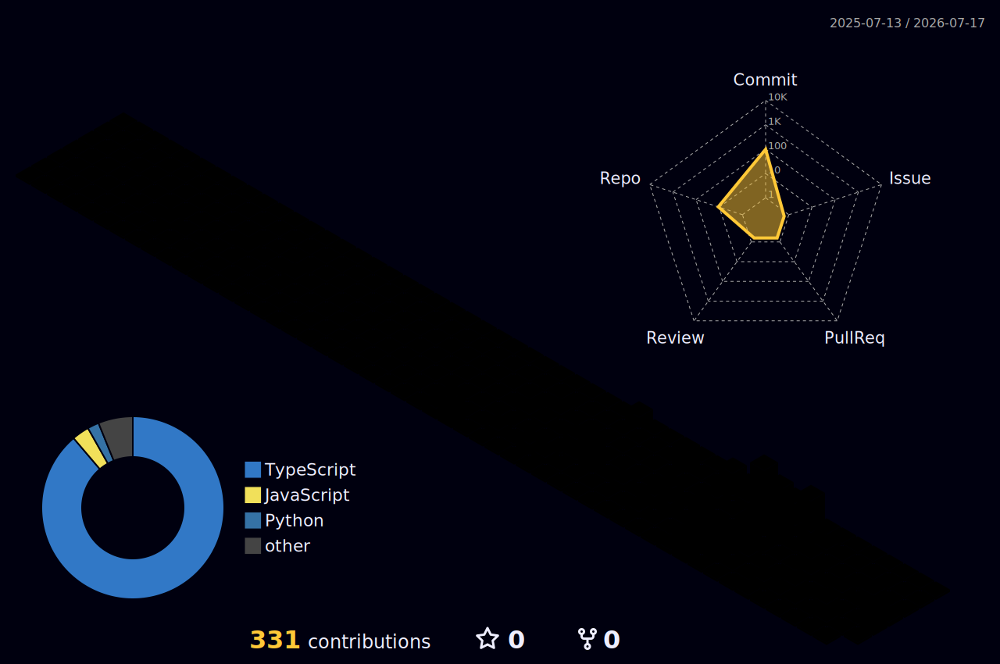

  

  
   
  

  

  
  
  

 

 

### 👨‍💻 Sobre mim
**Desenvolvedor focado em Automação, RPA e Inteligência Artificial** aplicada a negócios, criando soluções que reduzem trabalho manual, integram sistemas e transformam processos repetitivos em fluxos inteligentes.

Muitas empresas ainda perdem tempo com tarefas operacionais, dados espalhados, retrabalho entre sistemas e atendimentos que poderiam ser resolvidos com automações bem estruturadas. O resultado é previsível: times sobrecarregados, baixa produtividade e decisões tomadas sem dados confiáveis. Minha atuação é justamente resolver esse tipo de problema.

Desenvolvo automações com **n8n, Python, APIs, webhooks, SQL e integrações entre sistemas**, além de soluções com **IA generativa, LLMs, RAG, LangChain e chatbots inteligentes** para busca, atendimento, análise e geração de informação.

Também tenho forte experiência web utilizando tecnologias como **React, Next.js, Node.js, TypeScript e Tailwind CSS**, o que me permite não apenas automatizar processos, mas criar interfaces, dashboards e aplicações completas voltadas ao usuário final.

Meu foco: **menos tarefas manuais, mais eficiência operacional e inteligência aplicada ao negócio.** Aberto a oportunidades! Vamos conversar?

 
  

  

 

<picture>
    <source media="(prefers-color-scheme: dark)" srcset="./profile-3d-contrib/profile-night-rainbow.svg">
    <source media="(prefers-color-scheme: light)" srcset="./profile-3d-contrib/profile-season-animate.svg">
    
</picture>

### 🚀 Main Skills:
&nbsp;
&nbsp;
&nbsp;
&nbsp;
&nbsp;
&nbsp;
&nbsp;
&nbsp;
&nbsp;

### 🛠️ Other Knowledge:
&nbsp;
&nbsp;
&nbsp;
&nbsp;
&nbsp;
&nbsp;
&nbsp;
&nbsp;

### 📚 Studying in this moment:
&nbsp;
&nbsp;
&nbsp;
&nbsp;

